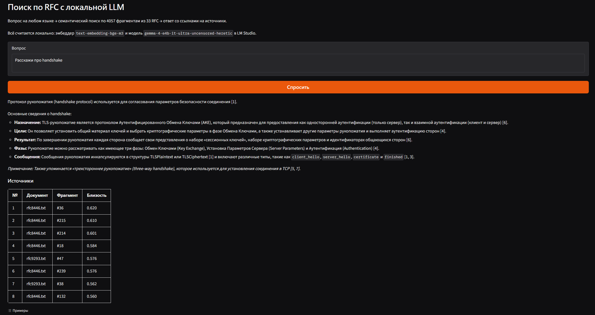
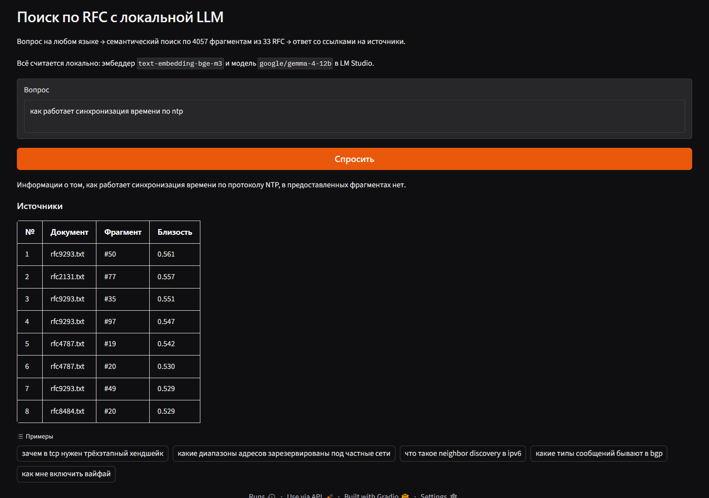

# RAG по RFC на локальных моделях

Вопрос на русском или английском → семантический поиск по корпусу из 33 RFC →
ответ, собранный локальной LLM, со ссылками на конкретные фрагменты источников.

Всё работает на одной машине, без внешних API: эмбеддер и языковая модель
крутятся в LM Studio, векторный поиск — на numpy.



## Как устроено

```
download_corpus.py   качает RFC с rfc-editor.org в corpus/
index.py             чистит, режет на фрагменты, считает эмбеддинги -> index_vectors.npy + index_chunks.json
rag.py               ядро: поиск, порог отсечки, сборка промпта, вызов LLM
ask.py               консольный интерфейс
app.py               веб-интерфейс на Gradio
search.py            отладка: показывает только результаты поиска, без генерации
```

Схема стандартная для RAG: документы заранее режутся на фрагменты, каждый
превращается в вектор из 1024 чисел. Вопрос превращается в такой же вектор,
дальше ищутся ближайшие по косинусной близости фрагменты, и они кладутся
в промпт языковой модели. Модель отвечает только по ним и проставляет номера
использованных фрагментов.

Детали, которые пришлось учесть:

- **Колонтитулы RFC** (`[Page 12]`, шапки с номером и датой) вырезаются перед
  нарезкой — иначе они попадают почти в каждый фрагмент и добавляют шум.
- **Таблицы в RFC идут сплошняком без пустых строк**, поэтому нарезка по абзацам
  порождала фрагменты по 11 тысяч токенов, которые эмбеддер молча обрезал
  по границе контекста. Добавлена принудительная резка по длине.
- **Перекрытие в один абзац** между соседними фрагментами, чтобы мысль
  не обрывалась ровно на границе.
- **Порог отсечки**: если лучшая близость ниже 0.55, языковая модель
  не вызывается вообще.

Параметры: фрагменты ~1500 символов, top-k = 8, порог 0.55.
Корпус — 33 RFC, 4057 фрагментов, матрица 4057×1024 float32 (16 МБ).

## Запуск

Нужен Python 3.12 и [LM Studio](https://lmstudio.ai/) с поднятым локальным
сервером на порту 1234 и двумя загруженными моделями:

- эмбеддер `bge-m3` (GGUF, ~1.2 ГБ) — многоязычный, поэтому русские вопросы
  находят английский текст;
- любая чатовая модель, помещающаяся в видеопамять. Тестировалось на Gemma 4 E4B
  (Q5, ~6 ГБ) рядом с эмбеддером на 12 ГБ VRAM.

```bash
python -m venv .venv
.venv\Scripts\python.exe -m pip install -r requirements.txt

.venv\Scripts\python.exe download_corpus.py    # качает корпус, пара минут
.venv\Scripts\python.exe index.py              # считает эмбеддинги, ~10 минут
.venv\Scripts\python.exe app.py                # http://127.0.0.1:7860
```

Настройки читаются из переменных окружения, значения по умолчанию рассчитаны
на локальный запуск. Имена моделей должны совпадать с тем, что отдаёт
`http://localhost:1234/v1/models` — список переменных лежит в `.env.example`.

## Запуск в Docker

Образ содержит только веб-сервис: моделей внутри нет, индекс подключается томом.
Это позволяет держать сервис на одной машине, а модели — на другой, где есть
видеокарта, и ходить к ним по HTTP.

```bash
cp .env.example .env        # прописать адрес сервера инференса и имена моделей
mkdir -p data && cp index_vectors.npy index_chunks.json data/
docker compose up -d --build
```

Контейнер слушает `127.0.0.1:7860` — наружу его выпускает обратный прокси,
а не docker напрямую. Индексация внутри контейнера не запускается: `index.py`
и `download_corpus.py` работают там, где лежит корпус и поднят эмбеддер.

## Что проверялось

Прогон по 19 вопросам трёх типов: есть ответ в корпусе, нет ответа,
и пограничные — на смежную тему, но ответа нет. Числа — косинусная близость
лучшего найденного фрагмента.

| Вопрос | Близость | Ожидалось | Результат |
|---|---|---|---|
| what is the purpose of the tcp three-way handshake | 0.706 | есть | ответ верный, топ-3 из RFC 9293 |
| сколько бит в адресе ipv6 | 0.678 | есть | верно, но процитирован не лучший источник |
| зачем в tcp нужен трёхэтапный хендшейк | 0.660 | есть | ответ верный |
| чем отличается tls 1.3 от предыдущих версий | 0.643 | есть | ответ верный и полный |
| какой номер порта у dhcp сервера | 0.640 | есть | верно (67) |
| чем адресация ipv6 отличается от ipv4 | 0.629 | есть | ответ верный |
| какой заголовок обязателен в http/1.1 запросе | 0.609 | есть | верно (Host) |
| что такое ttl в заголовке ip | 0.598 | есть | ответ верный |
| как настроить vlan | 0.580 | нет | **пересказала VXLAN вместо отказа** |
| как устанавливается соединение в quic | 0.575 | есть | ответ верный |
| как узел получает адрес: dhcp или slaac | 0.569 | есть | **нашлось только про DHCP** |
| что означает флаг rst в tcp | 0.563 | есть | ответ верный |
| как работает синхронизация времени по ntp | 0.561 | нет | порог не сработал, отказалась модель |
| есть ли трёхэтапный хендшейк в quic | 0.558 | нет | **ответила про фазы TLS** |
| опция 82 в dhcp | 0.550 | нет | порог не сработал, отказалась модель |
| чем отличается ethernet кабель от wifi | 0.547 | нет | отсечено порогом |
| как мне включить вайфай | 0.540 | нет | отсечено порогом |
| что такое snmp | 0.485 | нет | отсечено порогом |
| что такое mpls | 0.384 | нет | отсечено порогом |

Два наблюдения из этих замеров:

**Кросс-языковой поиск работает.** Один и тот же вопрос про TCP даёт 0.706
по-английски и 0.660 по-русски, в обоих случаях топ-3 фрагмента — из RFC 9293.
Русский чуть ниже, что ожидаемо для англоязычного корпуса.

**Абсолютный порог по косинусу не разделяет «есть ответ» и «нет ответа».**
Диапазоны перекрываются: вопросы с ответом лежат в 0.563–0.706, вопросы без
ответа — в 0.384–0.580. Ни одно значение порога не даёт чистого разделения,
поэтому порог оставлен низким (отсекает только явно постороннее), а тонкая
фильтрация переложена на языковую модель, которой в промпте разрешено
отказываться отвечать. Ложное срабатывание стоит одной лишней генерации,
ложный отказ — потерянного ответа.


## Ограничения

- **Общий термин утягивает в соседнюю тему.** Вопрос про трёхэтапный хендшейк
  в QUIC вытянул фрагменты про фазы TLS-хендшейка, и модель ответила про них.
  Формально всё честно процитировано, фактически ответ вводит в заблуждение.
- **Составные вопросы обрабатываются только наполовину.** «DHCP или SLAAC»
  находит фрагменты только про DHCP, хотя RFC 4862 лежит в корпусе. Поиск
  не разбивает вопрос на части.
- **Короткие вопросы занижаются.** Три слова против фрагмента в 1500 символов
  дают низкую близость даже при точном попадании (RST в TCP — 0.563).
- **На широких вопросах по длинным документам** ответ полон настолько,
  насколько повезло с выбором фрагментов: 8 кусков из RFC 8446 — это около
  3% документа.
- Модель иногда ссылается не на лучший из найденных фрагментов, а на более
  далёкий, где формулировка удобнее.

## Что дальше

- Реранкер (bge-reranker-v2-m3) вторым этапом поверх top-30 — должен закрыть
  и занижение коротких вопросов, и утягивание в соседнюю тему.
- Гибридный поиск: BM25 рядом с векторным, чтобы точные термины и номера
  («опция 82») не терялись.
- Разбиение составных вопросов на подзапросы.
- Замена numpy-поиска на Chroma или Qdrant — понадобится, когда корпус
  вырастет настолько, что полный перебор матрицы перестанет быть мгновенным.
- Стриминг ответа в веб-интерфейсе.
